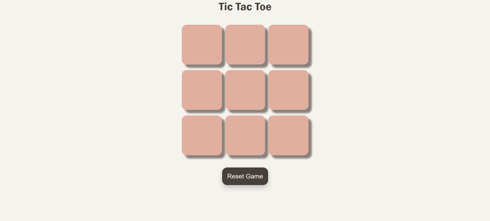
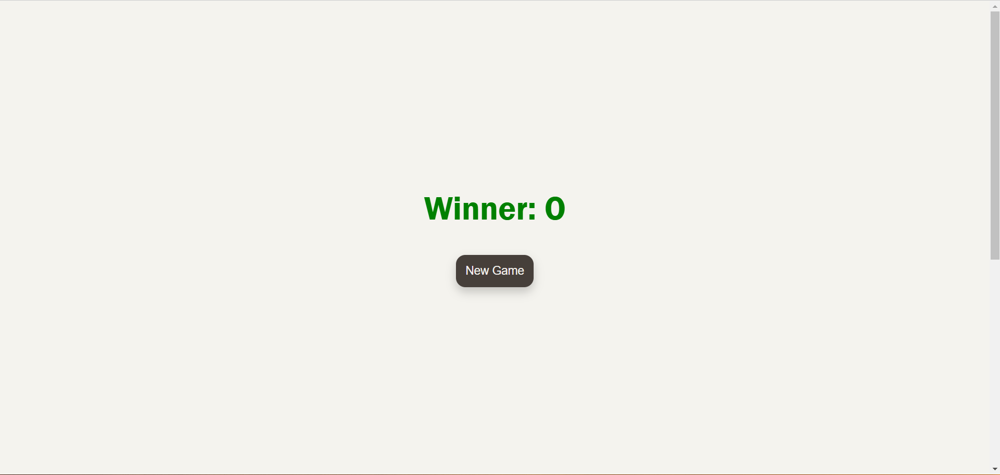

# 🕹️ Tic Tac Toe Game

A simple, interactive **Tic Tac Toe** game built using HTML, CSS, and JavaScript. Perfect for beginners to learn DOM manipulation, event handling, and responsive design.

---

## 🎮 Features
- **2-Player Mode**: Play as `X` or `O` against a friend.
- **Interactive UI**: Buttons change dynamically based on the player’s move.
- **Winner Declaration**: Displays the winner at the end of the game.
- **Reset & New Game Options**: Start fresh anytime.

---

## 🛠️ Technologies Used
- **HTML**: For game structure.
- **CSS**: For styling and responsiveness.
- **JavaScript**: For game logic and interactivity.

---

## 📸 Screenshots
### Initial Game Board


### Winner Declared


---

## 🚀 How to Run
1. Clone this repository:
   ```bash
   git clone https://github.com/sinha001/TicTacToe-MiniProject.git
   ```

2. **Navigate to the project folder**:
    ```bash
    cd tic-tac-toe
    ```

3. **Open the `@index.html` file in your browser**: 
   ```bash
   open index.html
   ```

4. **Enjoy playing Tic Tac Toe!**

---

## 📂 Project Structure

```graphql
tic-tac-toe/
│
├── index.html        # Main HTML file
├── style.css         # CSS for styling
├── script.js         # JavaScript for game logic
└── README.md         # Project documentation

```
---

## 💻 Game Logic Breakdown
- Winning Logic:
   - Predefined winning patterns are checked after every move.
- Turn Tracking:
   - Alternates between Player X and Player O.
- Reset Functionality:
   - Clears the board and starts a new game.

---

## 🌟 Future Enhancements
- Add a **1-Player Mode** against an AI opponent.
- Implement a **Scoreboard** to track wins.
- Make the game more responsive for smaller screens.

---

## 📧 Contact
Feel free to reach out if you have any questions or suggestions!  
**Email**: [nishantsinha.referral@gmail.com](mailto:nishantsinha.referral@gmail.com)  
**GitHub**: [sinha001](https://github.com/sinha001)

---

## ⭐ Contributions
Contributions are welcome! Fork the repository and submit a pull request. 😊

---

🏆 Play the Game & Have Fun!
```markdown

### Instructions:
- Replace **`yourusername`** with your GitHub username.
- Add your **email** and replace the demo image links with screenshots of your project.
- Include a live demo link if hosted (e.g., GitHub Pages or Netlify). 

This will make your repository stand out on GitHub! 🚀

```
